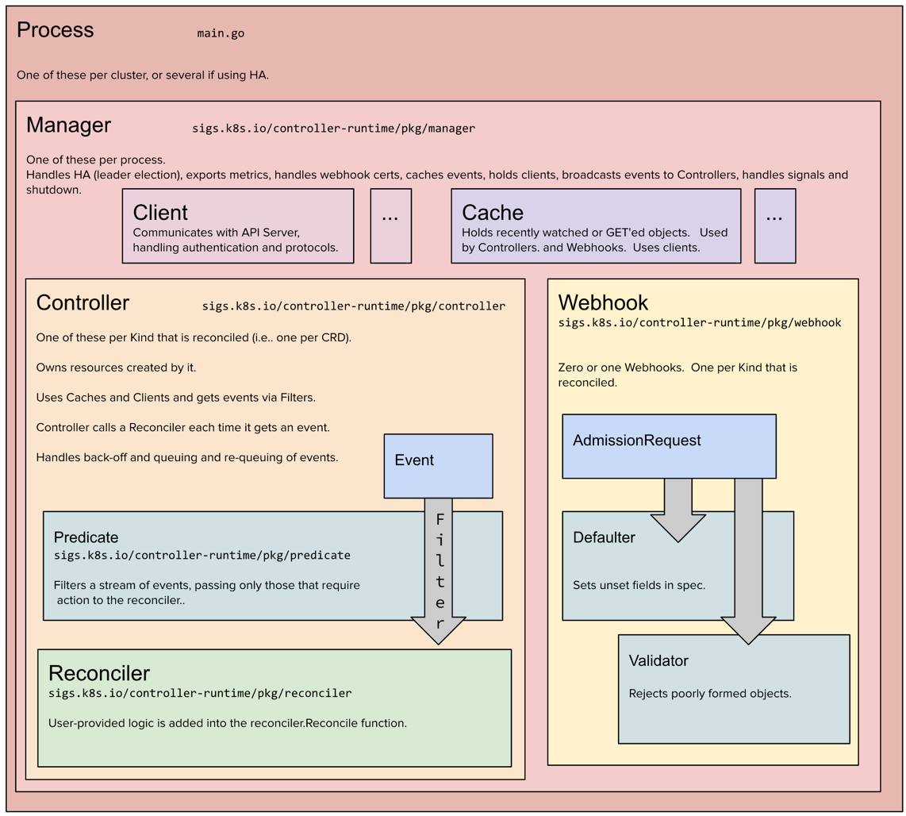

# nebula
Virtualenv operator

k8s 내에서 원하는 vm 을 생성합니다.

## Virtualenv
가상 환경을 의미한다. 
- provider -> properties ->  AWS, Openstack, GCP, ... 등 플랫폼 
  - auth (serviceaccountref) 
  - backup period
  - sleep period
- retrySettings

